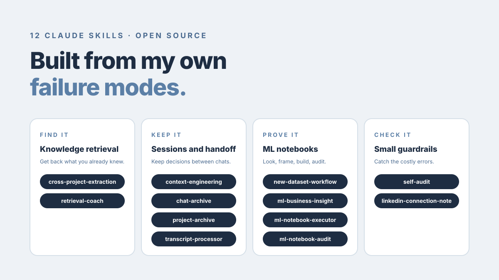
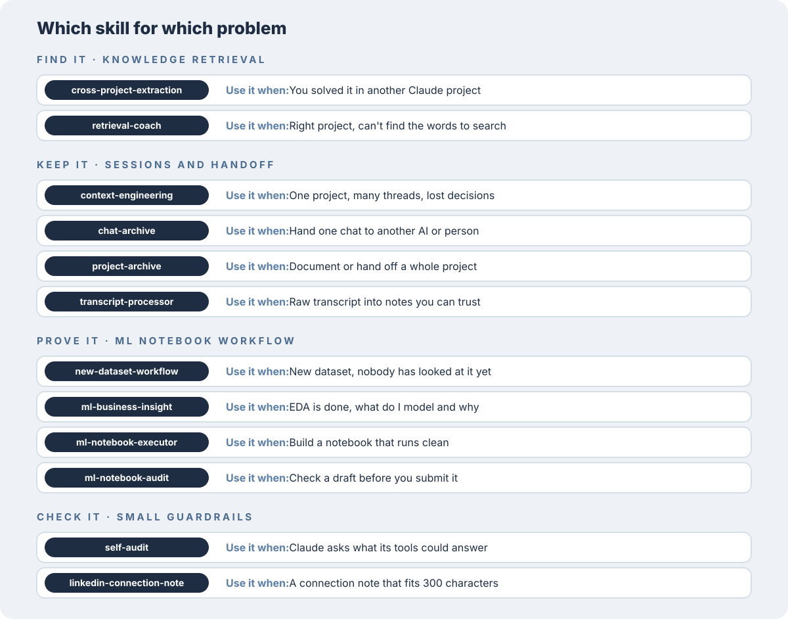
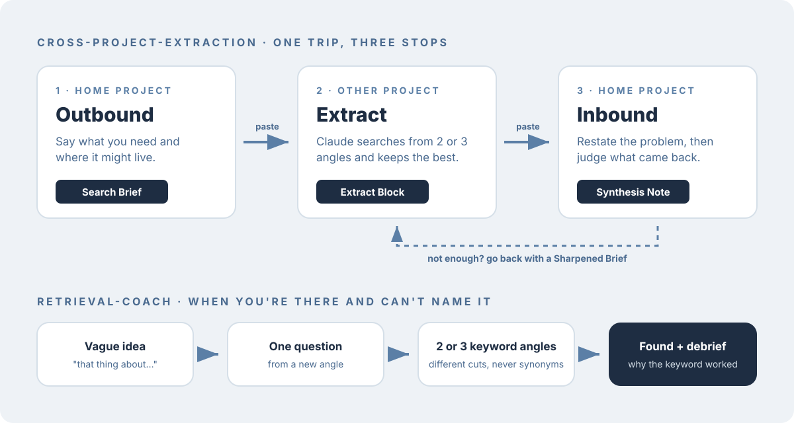

# lori-claude-skills

Twelve skills I built for Claude to fix problems I kept running into in my own work. Each one started as a failure I got tired of repeating. They are free to use and change.

A skill is a folder with a `SKILL.md` file that tells Claude how to handle one kind of task. Once installed, Claude picks it up on its own when the situation matches.

## Which skill for which problem

## The skills

### Knowledge retrieval

Get back what you already figured out.

| Skill | Use it when |
|---|---|
| [cross-project-extraction](cross-project-extraction/) | You solved something in one Claude project and need it in another |
| [retrieval-coach](retrieval-coach/) | You're in the right project and your search words keep missing |

### Sessions and handoff

Stop losing decisions between chats, and hand work over without pasting transcripts.

| Skill | Use it when |
|---|---|
| [context-engineering](context-engineering/) | One project runs across many threads and decisions keep getting lost |
| [chat-archive](chat-archive/) | You want to hand one chat to another AI, tool or person |
| [project-archive](project-archive/) | You want a whole Claude project documented or handed off |
| [transcript-processor](transcript-processor/) | You have a raw transcript and want notes you can trust |

`chat-archive` and `project-archive` need Notion connected.

### ML notebook workflow

Four steps, used in order. Each one stops and hands off to the next.

| Step | Skill | Use it when |
|---|---|---|
| 1 | [new-dataset-workflow](new-dataset-workflow/) | You have a dataset nobody has looked at yet |
| 2 | [ml-business-insight](ml-business-insight/) | EDA is done and you need to know what to model and why |
| 3 | [ml-notebook-executor](ml-notebook-executor/) | The direction is agreed and you want a notebook that runs clean |
| 4 | [ml-notebook-audit](ml-notebook-audit/) | A draft is finished and you want it checked before sharing |

### Small guardrails

| Skill | Use it when |
|---|---|
| [self-audit](self-audit/) | Claude asks you things its connected tools could answer, or apologizes and repeats the mistake |
| [linkedin-connection-note](linkedin-connection-note/) | You need a connection note that fits LinkedIn's 300-character limit |

## Install

**Claude app (web, desktop, mobile)**

1. Download this repo and zip the folder of the skill you want, for example `retrieval-coach`. The folder name has to match the skill name.
2. In Claude, go to **Customize > Skills**.
3. Click **+**, then **Create skill**, then **Upload a skill**.
4. Upload the zip.

Code execution has to be on for skills to work. On individual plans it is under **Settings > Capabilities**. On Team and Enterprise plans an owner turns it on for the organization.

**Claude Code**

Copy the skill folder into `~/.claude/skills/`.

Steps follow Anthropic's guide as of October 2026: [Use skills in Claude](https://support.claude.com/en/articles/12512180-use-skills-in-claude).

## Before you use them

Each skill folder has its own README with the problem behind it, what it does, what it refuses to do, and its limits. A few need a small edit first:

- `cross-project-extraction`: fill in the project map with your own projects.
- `context-engineering`: replace the placeholder file names with your own.
- `linkedin-connection-note`: replace the voice section with your own tone.

These were written for how I work and then cleaned up for sharing. Some were built during my MBA, so the ML set leans toward coursework. Change whatever doesn't fit.

## License

MIT. See [LICENSE](LICENSE).

Built by [Lorisca Cessia](https://lori-sca.github.io).
